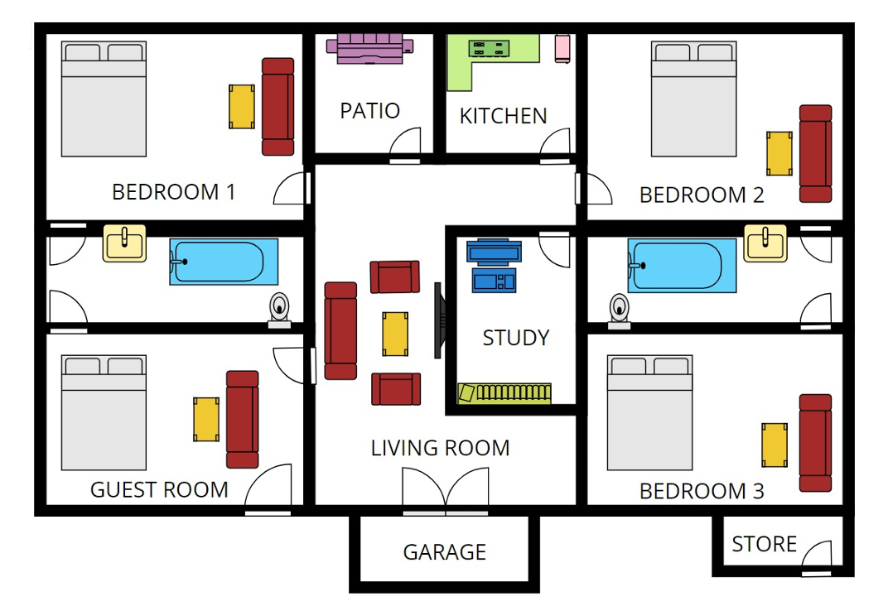
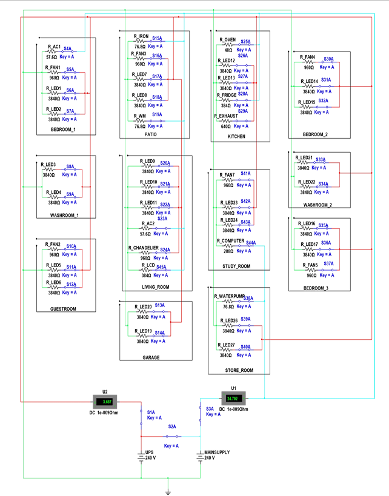
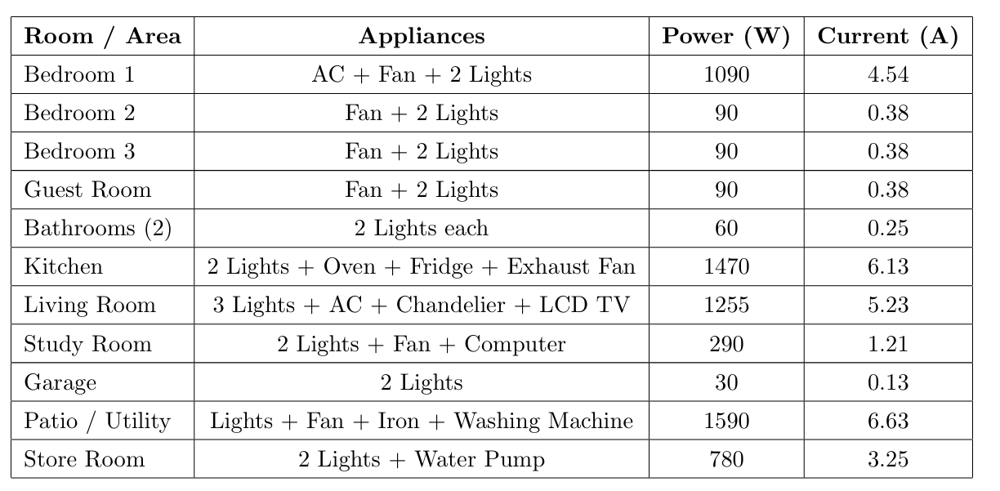
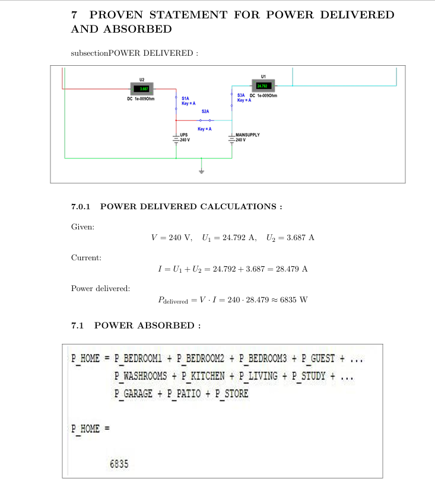

# 🏠 House Wiring Analysis and Load Distribution


## 📖 Project Overview

This project presents the complete design, analysis, and simulation of a residential house wiring system. The aim of the project is to design a safe and efficient electrical distribution network for a residential building, calculate room-wise electrical loads, analyze power consumption, and validate the design through MATLAB calculations and Multisim simulations.

The project demonstrates the practical application of electrical engineering concepts such as circuit analysis, power distribution, load calculations, wiring design, and backup power integration.

---

## 🎯 Objectives

- Design a complete residential electrical wiring system.
- Perform room-wise load analysis.
- Calculate voltage, current, resistance, and power consumption.
- Simulate the electrical network using Multisim.
- Verify electrical calculations using MATLAB.
- Analyze power delivered and power absorbed.
- Integrate UPS backup for essential loads.
- Ensure safe and efficient electrical distribution.

---

## 🛠 Software and Tools Used

| Software | Purpose |
|-----------|-----------|
| MATLAB | Electrical calculations and analysis |
| Multisim | Circuit simulation |
| LaTeX | Project documentation |
| Microsoft Office | Report preparation |

---

# 🏡 House Layout

The following image shows the floor plan used for designing the electrical distribution network.

<p align="center">

</p>

---

# ⚡ Complete House Wiring Circuit

The complete electrical circuit was designed and simulated using Multisim. The wiring network includes lighting circuits, fan circuits, socket outlets, air conditioning loads, kitchen appliances, and UPS backup integration.

<p align="center">

</p>

---

# 🔌 Electrical Appliances and Power Ratings

The following appliances were considered during the load analysis.

| Appliance | Quantity | Power Rating |
|------------|------------|------------|
| LED Lights | 12 | 15 W |
| Ceiling Fans | 5 | 75 W |
| Air Conditioners | 3 | 1500 W |
| Television | 1 | 120 W |
| Refrigerator | 1 | 300 W |
| Microwave Oven | 1 | 1200 W |
| Water Heater | 1 | 2000 W |
| Laptop Chargers | 2 | 65 W |
| Mobile Chargers | 3 | 15 W |
| Exhaust Fans | 2 | 40 W |


### Key Observations

- Water Heater is the highest power-consuming appliance.
- Air Conditioners contribute significantly to the total load.
- Kitchen appliances consume a major portion of household energy.
- Lighting and charging devices consume comparatively less power.

---

# 🏠 Room-Wise Load Analysis

The total load for each room was calculated by summing the power ratings of all connected appliances.

## Bedroom

| Appliance | Power |
|------------|------------|
| Lights | 60 W |
| Fan | 75 W |
| Air Conditioner | 1500 W |
| Chargers | 80 W |

### Total Bedroom Load

**1715 W**

---

## Living Room

| Appliance | Power |
|------------|------------|
| Lights | 75 W |
| Fan | 75 W |
| Television | 120 W |
| Air Conditioner | 1500 W |

### Total Living Room Load

**1770 W**

---

## Kitchen

| Appliance | Power |
|------------|------------|
| Refrigerator | 300 W |
| Microwave Oven | 1200 W |
| Exhaust Fan | 40 W |
| Lights | 45 W |

### Total Kitchen Load

**1585 W**

---

## Washroom

| Appliance | Power |
|------------|------------|
| Water Heater | 2000 W |
| Light | 15 W |

### Total Washroom Load

**2015 W**

---

## Garage

| Appliance | Power |
|------------|------------|
| Lights | 30 W |
| Socket Load | 500 W |

### Total Garage Load

**530 W**

---

# 📈 Room Power Distribution

The chart below represents room-wise power consumption within the house.

<p align="center">

</p>

### Summary

| Room | Total Power |
|---------|---------|
| Bedroom | 1715 W |
| Living Room | 1770 W |
| Kitchen | 1585 W |
| Washroom | 2015 W |
| Garage | 530 W |

---

# ⚙ Total House Load

| Room | Power |
|---------|---------|
| Bedroom | 1715 W |
| Living Room | 1770 W |
| Kitchen | 1585 W |
| Washroom | 2015 W |
| Garage | 530 W |

## Total Connected Load

```text
7615 Watts
≈ 7.6 kW
```

The calculated load indicates the overall electrical demand of the residential building under normal operating conditions.

---

# 🔢 Electrical Calculations

The following equations were used throughout the analysis.

### Current Calculation

I = P / V

### Power Calculation

P = V × I

### Resistance Calculation

R = V / I

Where:

- P = Power (Watts)
- V = Voltage (Volts)
- I = Current (Amperes)
- R = Resistance (Ohms)

---

# 📉 MATLAB Analysis

MATLAB was used to calculate:

- Room-wise loads
- Total house load
- Current requirements
- Power distribution
- Load verification


# 🔬 Multisim Simulation

The complete residential wiring network was simulated using Multisim.

Simulation objectives included:

- Voltage verification
- Current flow analysis
- Load balancing
- Power distribution validation
- UPS functionality testing

### Simulation Results

✅ All circuits operated successfully.

✅ Power delivered matched power absorbed.

✅ Voltage levels remained within safe limits.

✅ UPS backup system supplied critical loads correctly.

---

# 🔋 UPS Backup Integration

To improve system reliability, a UPS backup system was incorporated.

### Loads Supported by UPS

- LED Lighting
- Ceiling Fans
- Internet Router
- Mobile Charging
- Essential Electronics

### Benefits

- Continuous operation during power outages.
- Improved reliability and availability.
- Protection against sudden shutdowns.
- Enhanced user convenience.

---

# 📸 Final Project Results

The final project implementation and simulation results are shown below.

<p align="center">

</p>

---

# 📋 Key Findings

- Successfully designed a complete residential wiring network.
- Calculated room-wise electrical loads.
- Determined total house power demand.
- Verified calculations using MATLAB.
- Simulated electrical behavior using Multisim.
- Demonstrated successful UPS backup integration.
- Achieved safe and efficient power distribution.

---

# 🚀 Future Improvements

Potential future enhancements include:

- Smart Home Automation
- IoT-Based Energy Monitoring
- Solar Power Integration
- Smart Metering
- Automatic Load Management
- Energy Consumption Analytics
- AI-Based Power Optimization


# 👨‍💻 Author

### Muhammad Sufyan

Electrical Engineering Student PIEAS

### Skills Demonstrated

- Electrical Wiring Design
- Load Analysis
- Power Distribution Systems
- MATLAB Programming
- Multisim Simulation
- Circuit Analysis
- Technical Documentation

---

# 📜 License

This project is published for educational and academic purposes only.

If you found this project helpful, consider ⭐ starring the repository.
